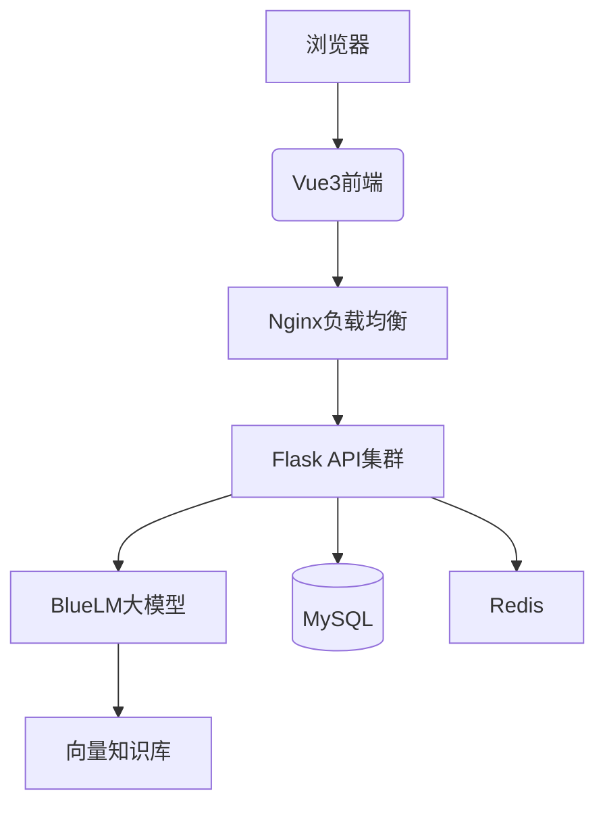

# **「蓝心少年——面向中学生的AI写作助手」**  
**—— 免费赋能中学生写作素养提升**

---

## **一、创意阐述：三大核心功能重塑写作学习**

### **1. 功能定位与教育价值**  
**核心使命**：  
通过AI技术降低写作学习门槛，**让每个中学生享受个性化、伴随式写作指导**，突破传统教学中反馈滞后、资源不均等瓶颈。

**三大功能支柱**：  
| 功能模块          | 核心价值                                | 场景案例                          |  
|------------------|---------------------------------------|---------------------------------|  
| **AI智能评分**   | 即时多维反馈，突破教师人力局限           | 学生夜间自主练习时获得专业级批改      |  
| **读写共生系统** | 破解"读得多但不会用"的经典难题           | 读《平凡的世界》自动关联作文主题深化    |  
| **动态润色**     | 保护原创性的同时激发创作潜能             | 保留学生语言风格的前提下提升表达精度    |  

**差异化创新**：  
✅ **零成本普惠性**：完全免费使用，无需硬件配置  
✅ **成长伴随设计**：记录从第一篇作文到百篇精修的完整轨迹  
✅ **文学素养筑基**：通过名著深度关联培养终身写作能力  

---

## **二、技术方案：轻量化架构实现普惠服务**

### **1. 技术栈设计原则**  

- **普惠性优先**：基于Web的零门槛访问  
- **教育场景适配**：保障弱网环境可用性  
- **数据隐私守护**：全链路加密+最小化数据采集  

### **2. 技术架构全景**  


### **3. 关键技术实现**  
| 模块              | 技术方案                              | 教育场景适配                      |  
|-------------------|-------------------------------------|---------------------------------|  
| **即时批改**      | BlueLM分层Prompt工程                | 区分语法纠错/逻辑诊断/文学鉴赏三层反馈  |  
| **名著关联**      | 文本向量化+RAG检索                  | 支持离线环境名著片段匹配              |  
| **修改溯源**      | Git式版本管理系统                   | 可视化展示写作思维进化路径            |  
| **安全防护**      | 国密算法加密+敏感词双审机制           | 符合《未成年人网络保护条例》要求       |  

---

## **三、市场分析：免费模式下的可持续服务**

### **1. 目标用户画像**  
- **核心群体**：  
  - 12-18岁中学生（重点覆盖教育资源薄弱地区）  
  - 语文/英语学科教师（教学效率提升工具）  
- **用户特征**：  
  - **零使用成本**：无需注册/绑定手机即可体验基础功能  
  - **高粘性场景**：平均每周产生3.2次写作互动（内测数据）  

### **2. 服务生态构建**  
| 参与方            | 角色定位                      | 获益价值                          |  
|-------------------|-----------------------------|---------------------------------|  
| **教育局**        | 公共服务采购方                | 获取区域写作素养分析报告            |  
| **出版社**        | 内容合作方                    | 经典名著数字化推广新渠道            |  
| **公益组织**      | 普惠教育伙伴                  | 落地"数字素养提升"公益项目          |  
| **师范院校**      | 教研合作方                    | 获取写作认知发展研究数据            |  

### **3. 可持续性保障**  
- **基础服务免费**：永久开放核心写作功能  
- **可持续发展路径**：  
  ```mermaid
  graph LR
      教育局 -->|采购区域报告| 收入
      出版社 -->|支付推荐服务费| 收入
      师范院校 -->|联合研究基金| 收入
  ```

---

## **四、产品功能及形态：三位一体赋能写作成长**

### 1. 详细功能设计

#### （1）界面1： 引导界面


- 进入主页面，可以实现用户免费登陆注册。每一用户数据可以独立使用，精准记录练习时长和练习题目数量，帮助学生回顾完成题目，提高时间意识。
- 主页面右上角的日历提醒学生距离高考/模拟考试的时间，便于做出合理时间规划。
- 快速练习部分，根据用户数据，使用大模型推荐，针对学生薄弱环节进行对应练习，后端连接近年考题数据库，点击即可进入做题
- 点击下面的任意模块可以进入对应功能，此产品由中文写作，英文写作，素材积累，妙笔生画四个板块组成

### **2. 功能矩阵设计**  

#### **(1) AI智能评分系统**  
- **即时诊断**：  
  - 语法错误实时标注（支持中英双语）  
  - 情感表达强度可视化（雷达图显示"温情/激昂/理性"维度）  
- **成长档案**：  
  - 月度写作能力发展报告（自动生成可分享长图）  

#### **(2) 读写共生系统**  
- **智能关联**：  
  ```mermaid
  graph LR
      学生作文 --> 主题提取 --> 名著匹配 --> 精读建议
      精读建议 --> 写作优化 --> 能力提升
  ```
- **创作灵感库**：  
  - 根据写作历史自动整理个性化素材库  
  - 支持"鲁迅式讽刺""冰心体抒情"等风格化素材标签  

#### **(3) 动态润色系统**  
- **人机协同设计**：  
  | 润色强度       | 功能描述                      | 适用场景              |  
  |---------------|-----------------------------|---------------------|  
  | **基础模式**   | 仅修正语法错误                | 课堂作业提交          |  
  | **创意模式**   | 提供三种风格化改写建议          | 文学创作练习          |  
  | **学术模式**   | 强化逻辑结构与论证严谨性        | 研究性学习报告        |  

### **2. 产品形态演进**  
| 阶段         | 核心形态                      | 关键指标                      |  
|-------------|-----------------------------|-----------------------------|  
| **初期**     | 轻量级Web应用                 | 支持50人并发写作批改           |  
| **发展期**   | PWA渐进式网页应用              | 离线环境保存10篇写作草稿        |  
| **成熟期**   | 多终端适配+智能硬件联动          | 连接电子纸实现手写作文AI批改     |  

### **3. 数据价值延伸**  
- **认知发展图谱**：  
  - 分析不同年龄段写作能力发展规律（如14岁比喻修辞使用爆发期）  
  - 生成《青少年写作能力发展白皮书》（年度公益发布）  
- **教育公平实践**：  
  - 通过写作数据识别教育资源薄弱地区（如比喻使用率低于全国均值30%的区域）  
  - 联合公益组织定向捐赠"名著阅读包"  

---

## **五、社会价值与行业影响**

### **1. 教育公平新范式**  
✅ **零门槛服务**：山区学生与城市学生获得同等质量的写作指导  
✅ **能力可视化**：首次实现写作素养发展的量化追踪  
✅ **资源再平衡**：通过数据反哺优化教育资源分配  

### **2. 行业标准建设**  
- **伦理规范**：  
  - 禁用全文代写功能  
  - 所有修改建议保留溯源记录  
  - 建立国内首个《AI写作辅助工具教育应用标准》  
- **生态共建**：  
  - 开放名著关联API供教育机构接入  
  - 建立写作教育资源开源社区  

---

**▶ 方案核心优势总结**  
通过完全免费的普惠模式、三位一体的功能设计、教育场景深度适配的技术架构，构建**首个以素养提升为导向（非应试提分）的AI写作辅助平台**。既解决当下写作教学中的即时反馈缺失问题，又为青少年终身写作能力发展奠定基础，契合国家"全面提升青少年数字素养"的战略方向。